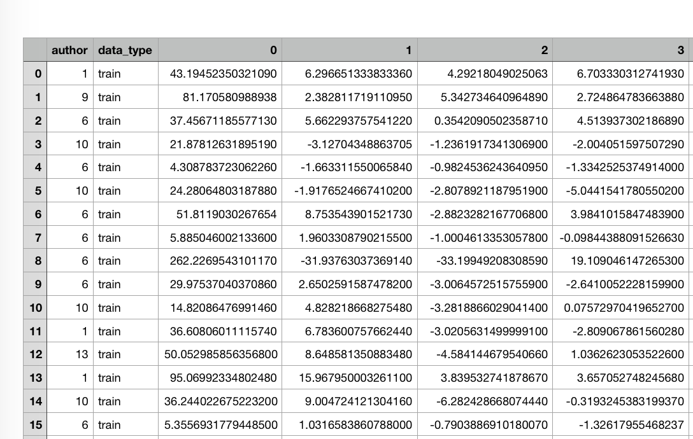
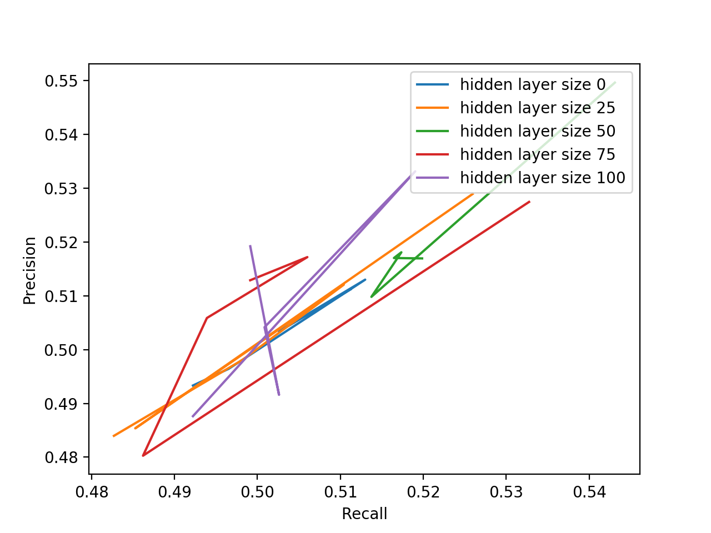

# LT2212 V20 Assignment 3

## Part 1

Run part 1, try:

​	`python3 a3_features.py CSV_FILE_NAME DIM_SIZE --test TEST_SIZE`

*Example*:

​	`python3 a3_features.py output.csv 100 --test 20`

The data structure of the output  `csv` file looks like below. I use `LabelEncoder` method transform the author's names into integer index for training dataset in part 2. `train` and `test`  are the two unique values in `data_type` column.

## Part 2 & 3

Run part 2 and 3, try:

​	`python3 a3_model.py output.csv --hiddensize HIDDEN_LAYER_SIZE --activation ACTIVATION_FUNC`

*Example*:

​	`python3 a3_model.py output.csv --hiddensize 100 --activation relu`

| Hidden layer | Non-linearity | accuracy | precision | recall | f1_score |
| ------------ | :-----------: | -------: | --------: | -----: | -------: |
| 0            |     None      |   0.5138 |    0.5140 | 0.5138 |   0.5136 |
| 0            |     ReLU      |   0.5087 |    0.5108 | 0.5087 |   0.5075 |
| 0            |     Tanh      |   0.4784 |    0.4788 | 0.4784 |   0.4779 |
| 50           |     None      |   0.4785 |    0.5002 | 0.4785 |   0.4108 |
| 50           |     ReLU      |   0.5156 |    0.5250 | 0.5156 |   0.4950 |
| 50           |     Tanh      |   0.5069 |    0.5168 | 0.5069 |   0.4980 |
| 100          |     None      |   0.4862 |    0.4745 | 0.4862 |   0.4622 |
| 100          |     ReLU      |   0.4948 |    0.5284 | 0.4948 |   0.4668 |
| 100          |     Tanh      |   0.4854 |    0.4805 | 0.4854 |   0.4714 |

I can not get very clear patten according to my testing result, all the scores are relatively similar. From my perspective, my model performed the best without any activation function and hidden layer. Both ReLU() and Tanh() preformed best with 50 hidden layers.

## Part Bonus

Run part 2 and 3, try:

​	`python3 a3_model.py output.csv --plotfile test.png`

I test 5 different hidden layer sizes(0, 25, 50, 75, 100) without any activation function. I run my model 5 times for each layer size in total, the lines are joined by 5 nodes in the images below. 